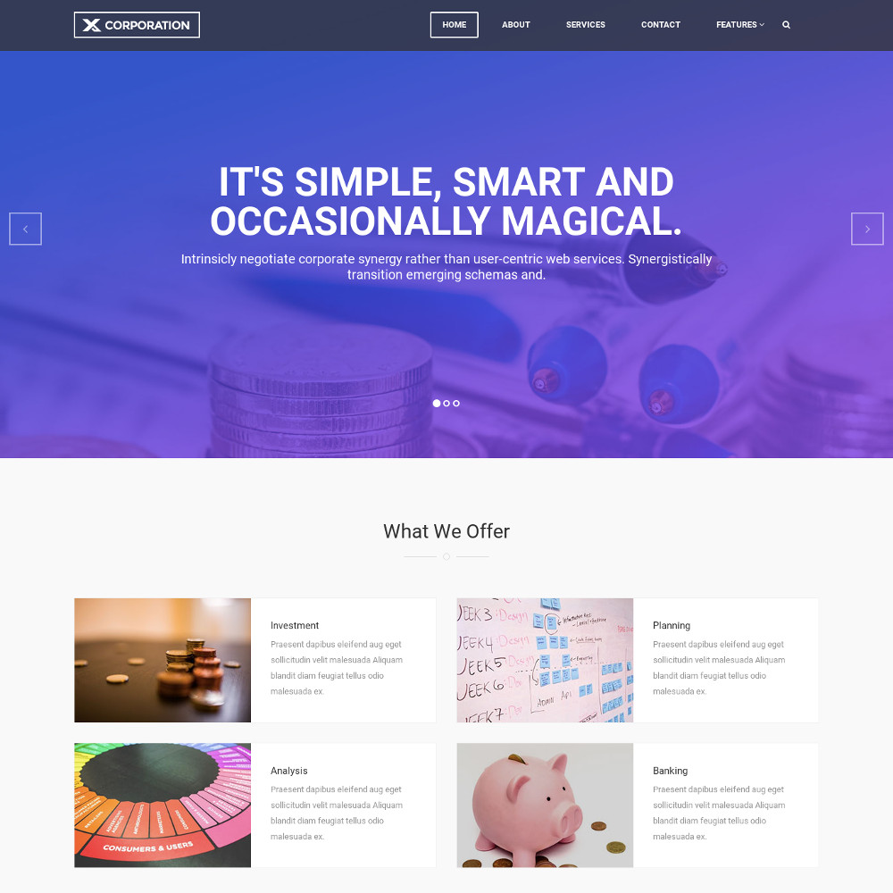
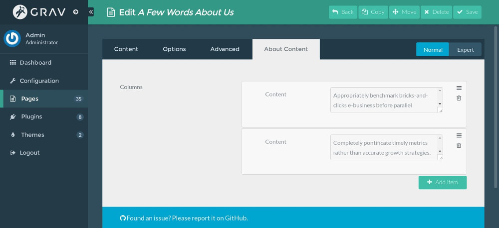
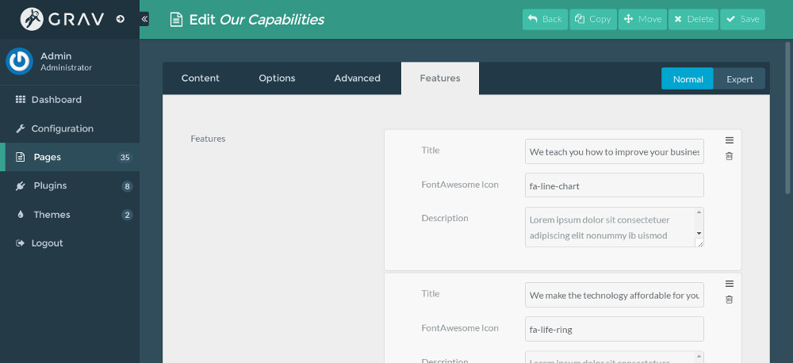
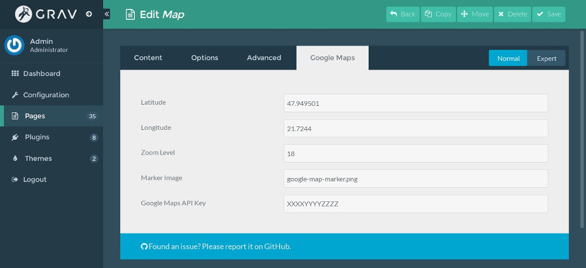
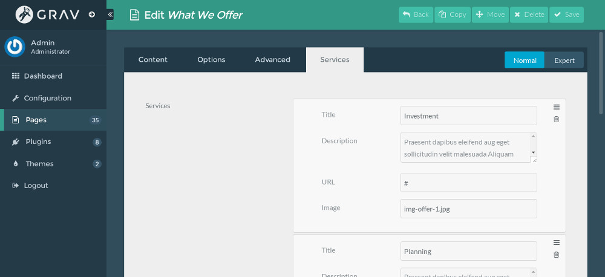
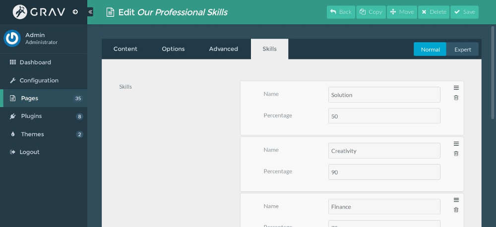
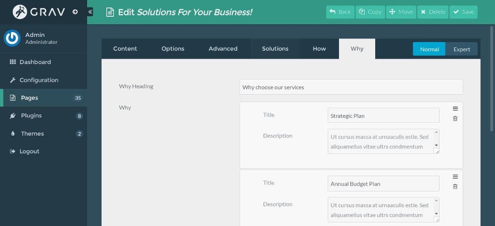

# X-Corporation theme for Grav CMS

X-Corporation theme is a port of [X-Corporation](https://uicookies.com/demo/#x_corporation) by [uiCookies](https://uicookies.com/).

# Features

* Professional user interface
* Responsive and mobile friendly
* Lightweight and fast loading
* Vibrant and clean typography
* Mega, sticky, and offcanvas menu
* Search engine optimized
* Modern browser compatible
* Infinitely and extensively customizable
* Sleek interaction and smooth scrolling
* Usage Of Latest Technology: HTML5, CSS3, JavaScript, Bootstrap 3 framework, Font Awesome, retina ready,

# Installation

## GPM Installation (Preferred)

The simplest way to install this theme is via the [Grav Package Manager (GPM)](http://learn.getgrav.org/advanced/grav-gpm) through your system's Terminal (also called the command line).  From the root of your Grav install type:

    bin/gpm install x-corporation

This will install the Gateway theme into your `/user/themes` directory within Grav. Its files can be found under `/your/site/grav/user/themes/x-corporation`.

## Manual Installation

To install this theme, just download the zip version of this repository and unzip it under `/your/site/grav/user/themes`. Then, rename the folder to `x-corporation`.

You should now have all the theme files under

    /your/site/grav/user/themes/x-corporation

## Required Plugins:

* [Error](https://github.com/getgrav/grav-theme-error)
* [Problems](https://github.com/getgrav/grav-plugin-problems)
* [Email](https://github.com/getgrav/grav-plugin-email)
* [Form](https://github.com/getgrav/grav-plugin-form)

# Setup

If you want to set X-Corporation as the default theme, you can do so by following these steps:

* Navigate to `/your/site/grav/user/config`.
* Open the **system.yaml** file.
* Change the `theme:` setting to `theme: x-corporation`.
* Save your changes.
* Clear the Grav cache. The simplest way to do this is by going to the root Grav directory in Terminal and typing `bin/grav clear-cache`.

Once this is done, you should be able to see the new theme on the frontend. Keep in mind any customizations made to the previous theme will not be reflected as all of the theme and templating information is now being pulled from the **x-corporation** folder.

# Configuration with Admin plugin

If you have [Admin plugin](https://github.com/getgrav/grav-plugin-admin) installed, you can fully manage the sub-pages (modular pages) via Admin plugin.

## About sub-page

About content is shown as columns, you can add as many columns as you like.

## Carousel

Carousel is used in home page. Each slide has heading, description, background image and description of background image. Background image is file name of an image in the same folder.

## Clients

Client has name, image and website. Image is a file in the same folder of sub-page.

## Features

Feature has title, icon and description. Icon is a class of Font Awesome icon, for example "fa-line-chart".

## Map

Map sub-page is used to show Google map. You need to provide location's coordinates, zoom level of the map, Google Maps API key. If you want to use a custom marker, you put marker image in the same and enter its file name into "Marker Image" field.

## Services

Service has title, description, URL and image. Image is an image file in sub-page's folder.

## Skills

Skill has name and a percentage value (0 - 100).

## Solutions

Solution sub-page has 3 parts:

* **Solutions**: Each solution has title, description and Font Awesome icon.
* **How We Work**: You can customize the heading "How We Work", each reason has title and description.
* **Why Choose Our Services**: Similar to **How We Work**.

## Team

Team member has name, position, URL to member page and an image. Image is stored in the same folder.

## Testimonials

Testimonial has client's name, client's image and testimonial's content. Image is stored in the same folder.

# Updating

## GPM Update (Preferred)

The simplest way to update this theme is via the [Grav Package Manager (GPM)](http://learn.getgrav.org/advanced/grav-gpm). You can do this with this by navigating to the root directory of your Grav install using your system's Terminal (also called command line) and typing the following:

    bin/gpm update x-corporation

This command will check your Grav install to see if your Gateway theme is due for an update. If a newer release is found, you will be asked whether or not you wish to update. To continue, type `y` and hit enter. The theme will automatically update and clear Grav's cache.

## Manual Update

Manually updating X-Corporation is pretty simple. Here is what you will need to do to get this done:

* Delete the `your/site/user/themes/x-corporation` directory.
* Download the new version of the X-Corporation theme from this repository.
* Unzip the zip file in `your/site/user/themes` and rename the resulting folder to `x-corporation`.
* Clear the Grav cache. The simplest way to do this is by going to the root Grav directory in terminal and typing `bin/grav clear-cache`.

> Note: Any changes you have made to any of the files listed under this directory will also be removed and replaced by the new set. Any files located elsewhere (for example a YAML settings file placed in `user/config/themes`) will remain intact.
